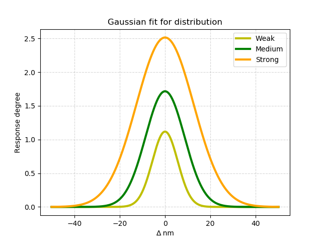

### Generalization networks
#### By Vini Salazar
#### Theoretical work by Hugo Bayer and Lara Ferst

Behavioural generalization is the process where memories formed in specific events
start generating responses over different stimuli. Therefore, generalizing stimuli
is vital for organisms, both to find resources and forage efficiently, and to be
able to protect themselves from threat-associated stimuli.

This is a work in progress on employing neural networks and machine learning to
simulate animal behavioural generalization experiments. We are happy to annouce
our preliminary work will be presented at the [XXXVI Brazilian Ethology Meeting.](https://eae2018.ufop.br/)


```
pip install -r requirements.txt

# Graph with visualization
python src/network_viz.py

# Graph without visualization
python src/network_noviz.py

# Gaussian distribution
python src/gauss.py
```


`img` contains some plots.  
`src` contains code for generating plots.

Contributions are welcome!
